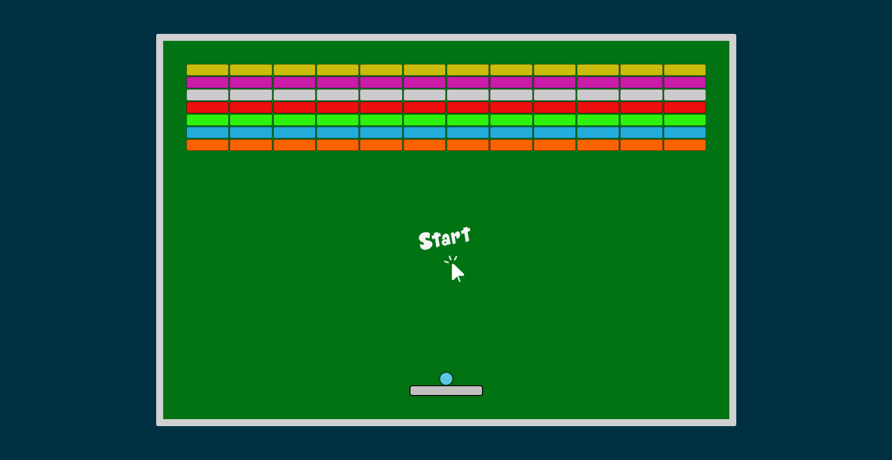

# Breakout

Breakout is an web based arcade video game. It has a layer of bricks lines at top of the screen and  the goal is to destroy them all by repeatedly bouncing a ball off a paddle into them without colliding with bottom wall.

## [Live Preview](https://malihassandev.github.io/Break-Out-Game/)

## Rules of the game
1. The goal of the game is to **break all the bricks** on the top of the screen by colliding the ball with them.
2. After successful hit the target brick disappears and number of bricks decreases.
3. Player can only use paddle at the bottom of board to stop ball hitting the bottom wall of board.
3. The paddle on the bottom is controlled by mouse and can only be moved horizontally.
4. Each new game has **three lives**. when the ball hits the bottom wall  the lives count is decreased by one.
5. Player has to make sure that ball lands on the **rectangular board instead of bottom wall**.
6. **Game finishes** when the ball hits the bottom wall for the third time.

## Features

- **Paddle Control**
  - Player-controlled paddle at bottom of screen
  - Horizontal movement (left/right)
  - Reflects ball at different angles based on impact point

- **Ball Mechanics**
  - Dynamic ball movement with realistic bouncing
  - Collision detection with walls, paddle, and blocks
  - Progressive speed increase for added challenge

- **Bricks System**
  - Multiple rows of destructible bricks
  - Varied bricks colors for visual appeal
  - Blocks disappear on ball collision

- **Scoring System**
  - Points awarded for each broken block
  - Score display during gameplay
  - Highest Score display at end of game

- **Player Progress**
  - 3 lives system
  - Game over when all lives are lost
  - Level progression system

- **Audio**
  - Block destruction sound effects
  - Paddle hit sounds
  - Wall collision audio
  - Game over sound
## Tech Stack
- Html 
- Javascript
- Css
## Outcome
- Implemented custom collision detection.
- Improved usage of modular architecture.
- Learned the usage of DomRect object to bet element coordinates.
- Implemented conditional rendering based on user actions.
## Navigation
- My next project [UserAuth-Vanilla-NodeJs](https://github.com/MAliHassanDev/UserAuth-Vanilla-NodeJs)
- My previous project [Secure Life](https://github.com/MAliHassanDev/Secure-Life)